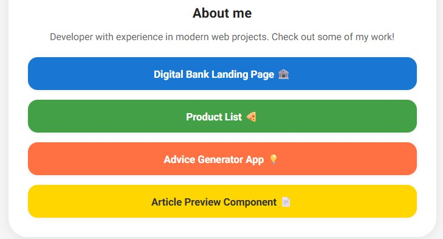

# Webpack Profile Card

This project is a personal profile card built with HTML, CSS, and JavaScript, using Webpack as the bundler. It features a section for highlighted projects, social media links, and a modern, responsive design.




## Links

- Live Site URL: [Click here!](https://santiagodev10.github.io/Profile-card/)

## Features

- Profile card with photo, name, username, and bio.
- Display of main skills.
- Social media links (GitHub, Twitter, Medium).
- "About me" section with a short description.
- Dynamic list of featured projects, each with a link and emoji.
- Modern, responsive styles.
- Bundling and optimization with Webpack.
- Scripts for development, build, and deployment to GitHub Pages.

## Project Structure

```
├── public/
│   ├── index.html
│   ├── styles.css
│   └── images/
├── src/
│   └── index.js
├── package.json
├── webpack.config.js
└── .gitignore
```

## Available Scripts

- `npm start` – Starts the development server with hot reload.
- `npm run build` – Generates the optimized production build in the `dist` folder.
- `npm run deploy` – Publishes the contents of `dist` to GitHub Pages.

## Installation

1. Clone the repository.
2. Run `npm install` to install dependencies.
3. Use `npm start` for development or `npm run build` for production.

## Deployment

You can easily deploy the project to GitHub Pages using:

```sh
npm run deploy
```

## Author

Santiago Perozo – [@santiagoDev](https://github.com/santiagodev10)

---

Feel free to explore the code and customize it for your own portfolio!